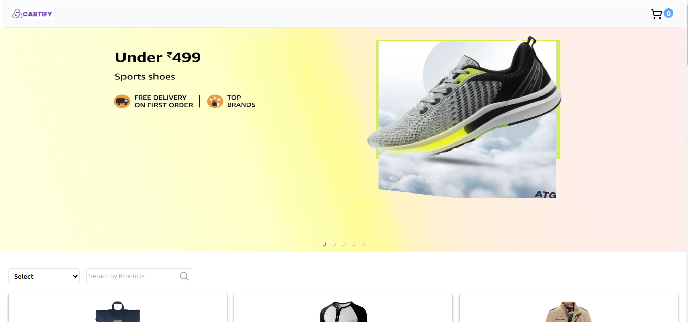

# REDUX CARTIFY 🛒 

This application was developed to explore Redux concepts in an E-commerce Website.

## Preview



## Technologies Used
- [**Vite**](https://vitejs.dev/) + [**React**](https://reactjs.org/): Fast and lightweight development environment and framework for building modern web applications. 

- [**Tailwind CSS**](https://tailwindcss.com/): A utility-first CSS framework for quickly building custom designs.

- [**Redux Toolkit**](https://redux-toolkit.js.org/): The official, opinionated, batteries-included toolset for efficient Redux development

## Table of Contents

- [Prerequisites](#prerequisites)
- [Installation](#installation)
- [Usage](#usage)
- [Cart Slice and Actions](#cart-slice-and-actions)
- [Deployment](#deployment)
- [Contributing](#contributing)
- [License](#license)

## Prerequisites

Before you begin, ensure you have the following prerequisites:

- Node.js and npm installed.

## Installation

1. **Clone the repository**
```bash   
git clone https://github.com/kamalj57/ReduxStore.git
```
2. **Install the necessary dependencies**
```bash
npm install
```

## Usage
**To Start**
```bash
npm run dev
```
Visit http://localhost:5173 in your browser to access the application.


## Cart Slice and Actions
**To  add Redux Toolkit and React-Redux packages**
```bash
npm install @reduxjs/toolkit react-redux
```
**Create a Redux Store**


**Create a Redux CartSlice**

In this project, we've created a Redux slice for managing cart items. The slice includes the following actions


  - **itemsAdded**: Adds an item to the cart.
  - **incrementedquantity**: Increments the quantity of a specific item in the cart.
  - **decrementedquantity**: Decrements the quantity of a specific item in the cart.
  - **itemsDeleted**: Deletes an item from the cart.

## Deployment
Follow your preferred deployment method to deploy the application. Ensure to set the environment variables for production in your deployment environment.

## Contributing
Contributions are welcome! Feel free to open issues and pull requests.

## License
This project is licensed under the MIT License.

